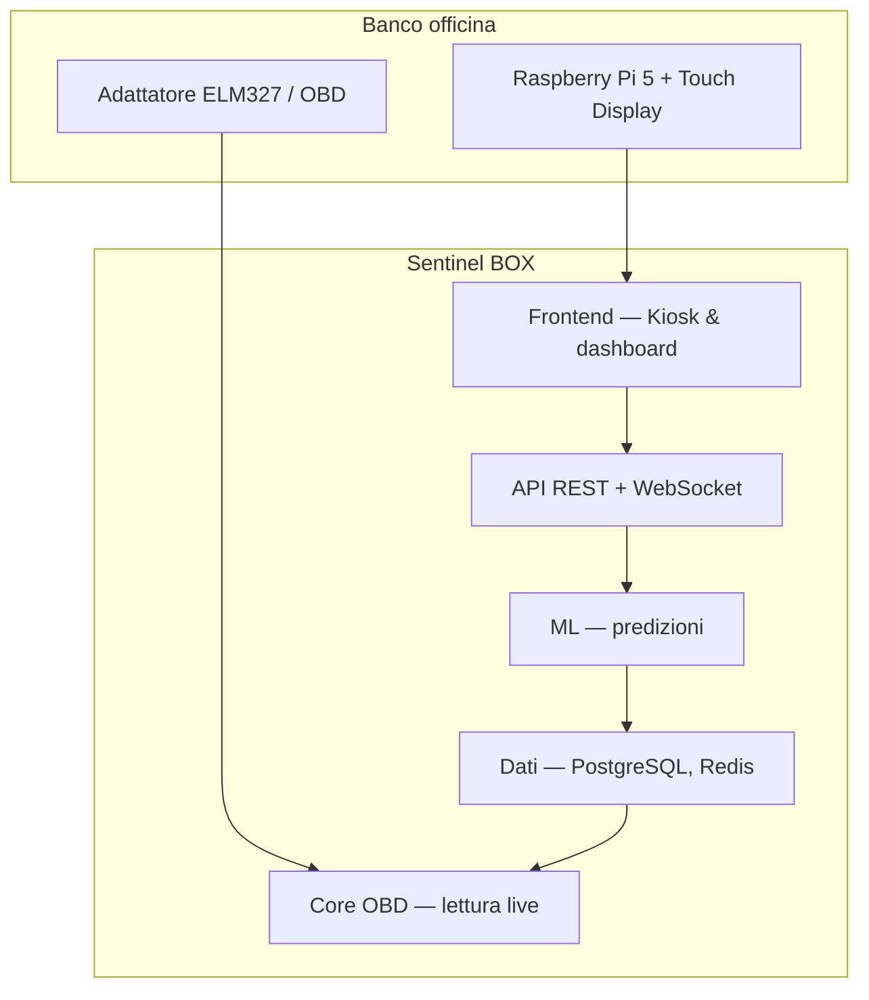
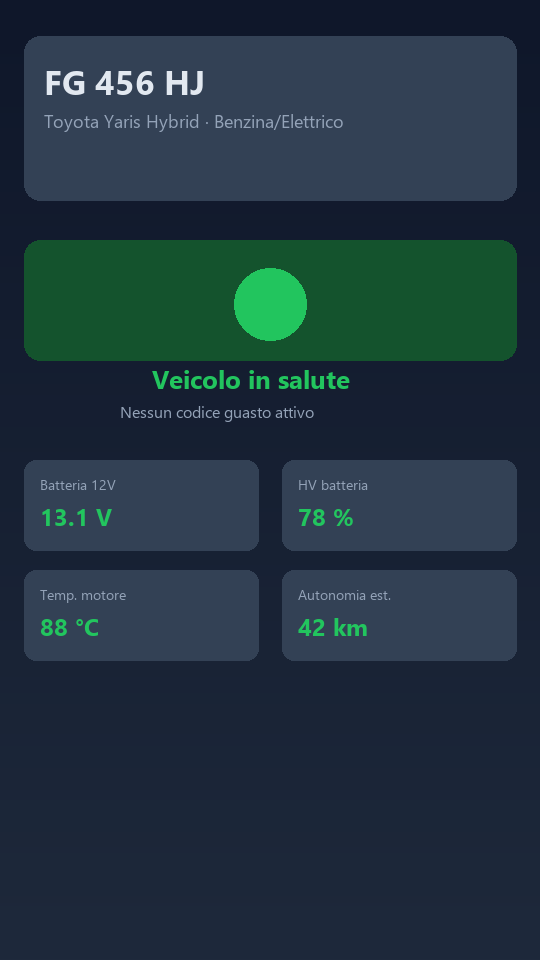

# Sentinel BOX — Showcase

> **Predici i Problemi, Previeni i Guasti.**

Repository **pubblico solo per presentazione** (CV, portfolio, demo commerciale).  
**Non contiene codice sorgente** del prodotto — il software è proprietario e sviluppato in repository privato.

---

## Cos'è Sentinel BOX

**Sentinel BOX** è una piattaforma di diagnostica e manutenzione predittiva pensata per **officine indipendenti** e **reti concessionarie**. Collega il veicolo alla presa OBD, legge centraline (OBD-II + UDS), applica modelli di machine learning e restituisce un referto chiaro per il meccanico e per il cliente.

Il cuore dell'esperienza in officina è la **modalità kiosk** su **Raspberry Pi** con touchscreen: schermata unica, semaforo di stato, codici guasto leggibili a distanza, telemetria live e stampa referto PDF.

---

## Problema

- Strumenti diagnostici spesso costosi, complessi o poco adatti al banco officina.
- Dati OBD grezzi difficili da interpretare per chi deve lavorare sotto pressione.
- Mancanza di un flusso unificato: diagnosi → priorità → referto per il cliente.

## Soluzione

| Area | Cosa fa Sentinel BOX |
|------|----------------------|
| **Riconoscimento** | Identificazione automatica veicolo (VIN, marca/modello, alimentazione) |
| **Diagnosi** | Scansione multi-ECU, codici guasto, parametri vitali |
| **Predizione** | Modelli ML su batteria, tagliando, anomalie sensori |
| **Officina** | Kiosk touch full-screen, guida intervento sui DTC |
| **Cliente** | Referto PDF con QR, passaporto salute veicolo |

---

## Architettura (overview)

**Stack tecnologico:** Python (FastAPI), Next.js / React, PostgreSQL, Redis, modelli ML (scikit-learn), deploy Docker su Raspberry Pi.

---

## Schermate prodotto

> Aggiungi qui gli screenshot reali del Pi o della dashboard.  
> File consigliati in `assets/screenshots/` (vedi README nella cartella).

### Kiosk officina — stato veicolo e guasti

*Schermata kiosk: veicolo identificato, barra stato, codici guasto, telemetria e azioni stampa/uscita.*

### Kiosk — veicolo in salute

*Esito positivo dopo scansione: messaggio chiaro per officina e cliente.*

### Dashboard / referto (opzionale)

*Anteprima referto PDF o vista gestionale (se disponibile).*

---

## Casi d'uso

1. **Officina indipendente** — tablet o Pi al banco: il meccanico vede subito cosa controllare.
2. **Rete multi-sede** — stesso flusso diagnostico e referto standardizzato.
3. **Ibrido / EV** — lettura parametri HV oltre alla diagnostica classica 12V.

---

## Stato progetto

| Componente | Stato |
|------------|--------|
| Core OBD + API | ✅ Operativo |
| Kiosk Pi portrait (720×1280) | ✅ Deploy produzione su Raspberry Pi |
| Modelli ML predittivi | ✅ Integrati |
| Referto PDF + QR | ✅ |
| Repository codice | 🔒 Privato (proprietario) |

---

## Contatto / CV

**Progetto:** Sentinel BOX — full-stack IoT + ML per automotive aftermarket  
**Ruolo:** [inserisci il tuo ruolo — es. Product & software development]  
**Repository codice:** non pubblico (su richiesta in colloquio)

---

*© Sentinel BOX — tutti i diritti riservati. Questo repository contiene solo materiale descrittivo e screenshot; è vietata la riproduzione del software senza autorizzazione.*
