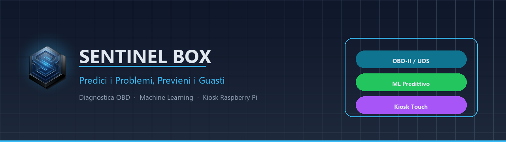
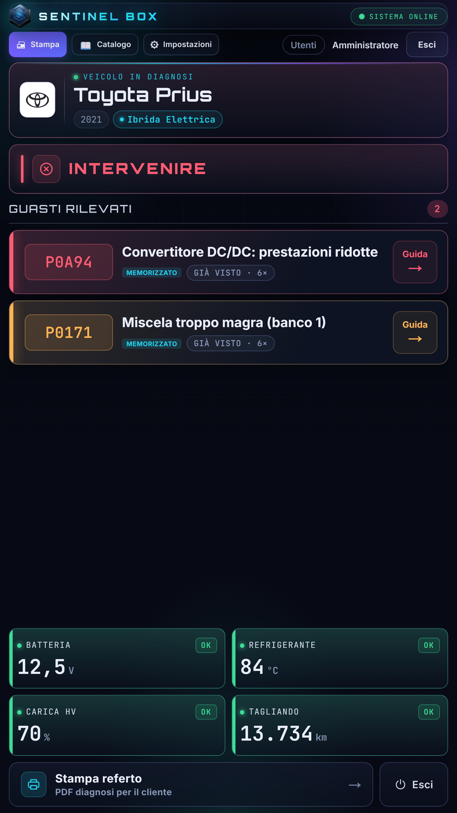
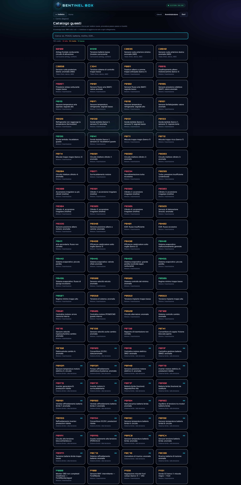
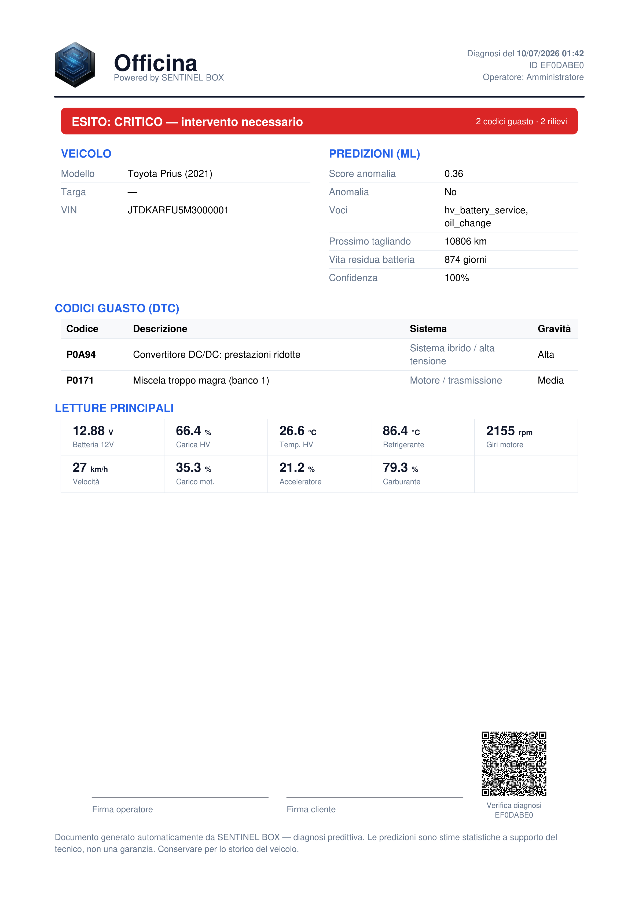
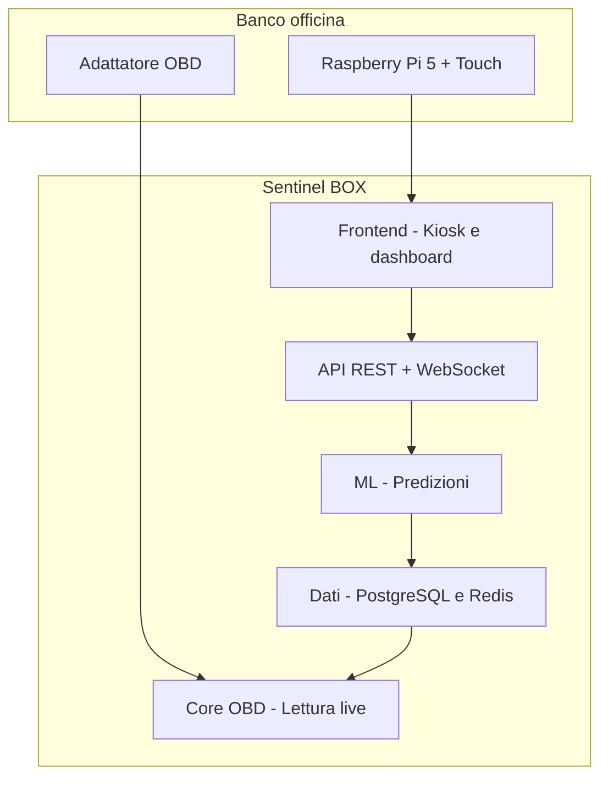

<p align="center">
  
</p>

<p align="center">
  <strong>Piattaforma di diagnostica e manutenzione predittiva per officine automotive</strong><br />
  OBD-II · Machine Learning · Kiosk touch su Raspberry Pi
</p>

<p align="center">
  
  
  
  
</p>

---

## Indice

- [Panoramica](#panoramica)
- [Il problema](#il-problema)
- [La soluzione](#la-soluzione)
- [Flusso in officina](#flusso-in-officina)
- [Schermate prodotto](#schermate-prodotto)
- [Architettura](#architettura)
- [Stack tecnologico](#stack-tecnologico)
- [Casi d'uso](#casi-duso)
- [Stato del progetto](#stato-del-progetto)

---

## Panoramica

**Sentinel BOX** collega il veicolo alla presa OBD, legge le centraline (OBD-II e UDS), applica modelli di machine learning e produce un referto chiaro per il **meccanico** e per il **cliente finale**.

L'esperienza in officina è pensata per il banco lavoro: **schermata unica**, testi grandi, semaforo di stato immediato, fino a tre codici guasto in evidenza, telemetria live e stampa referto PDF con QR per il passaporto salute del veicolo.

| Target | Beneficio |
|--------|-----------|
| **Officina indipendente** | Diagnosi rapida senza strumenti da migliaia di euro |
| **Rete concessionaria** | Referto standardizzato su tutte le sedi |
| **Cliente finale** | Spiegazione comprensibile, non solo codici grezzi |

---

## Il problema

Gli strumenti diagnostici professionali sono spesso **costosi**, **complessi** o pensati per il tecnico esperto, non per il ritmo dell'officina quotidiana.

| Pain point | Impatto |
|------------|---------|
| Dati OBD grezzi | Il meccanico perde tempo a interpretare codici e parametri |
| Strumenti frammentati | Diagnosi, referto e comunicazione al cliente su sistemi diversi |
| Poca predittività | Si interviene al guasto, non prima |

---

## La soluzione

<table>
<tr>
<td width="50%" valign="top">

### Riconoscimento veicolo
Identificazione automatica tramite VIN: marca, modello, alimentazione e contesto diagnostico.

### Diagnosi multi-ECU
Scansione codici guasto (DTC), parametri vitali e stato centraline in tempo reale.

### Predizione ML
Modelli su batteria, tagliando e anomalie sensori per anticipare gli interventi.

</td>
<td width="50%" valign="top">

### Kiosk officina
Interfaccia touch full-screen su Raspberry Pi, ottimizzata per display portrait 720×1280.

### Guida intervento
Priorità guasti, severità e suggerimenti operativi direttamente sul banco.

### Referto cliente
PDF professionale con QR verso il passaporto digitale del veicolo.

</td>
</tr>
</table>

---

## Flusso in officina

```
  Collegamento OBD          Scansione & ML           Esito kiosk              Referto PDF
        │                        │                       │                        │
        ▼                        ▼                       ▼                        ▼
   ┌─────────┐            ┌───────────┐           ┌───────────┐           ┌───────────┐
   │ Veicolo │  ────────▶ │ Sentinel  │ ────────▶ │ Semaforo  │ ────────▶ │ Cliente & │
   │  + Pi   │            │   BOX     │           │ + DTC +   │           │ officina  │
   └─────────┘            └───────────┘           │ telemetria│           └───────────┘
                                                   └───────────┘
```

1. Il meccanico collega l'adattatore OBD e avvia la scansione dal kiosk.
2. Il sistema identifica il veicolo e analizza centraline e parametri.
3. I modelli ML arricchiscono l'esito con predizioni manutentive.
4. Il kiosk mostra priorità e telemetria; con un tap si stampa il referto.

---

## Schermate prodotto

### Kiosk touch — portrait (Raspberry Pi)

<p align="center">
  
</p>

<p align="center">
  <sub>Riconoscimento veicolo · semaforo INTERVENIRE · DTC prioritizzati · guida intervento · telemetria HV · stampa referto</sub>
</p>

### Catalogo guasti — knowledge base

<p align="center">
  
</p>

<p align="center">
  <sub>Knowledge base integrata: codici OBD documentati con severità, sistema e guida intervento · ricerca full-text</sub>
</p>

### Referto PDF per il cliente

<p align="center">
  
</p>

<p align="center">
  <sub>Referto stampabile: esito critico, predizioni machine learning, codici guasto, letture OBD e QR verifica diagnosi</sub>
</p>

> Screenshot catturati dal Raspberry Pi 5 in produzione (simulatore OBD demo, Toyota Prius 2021 ibrida).

---

## Architettura



---

## Stack tecnologico

| Layer | Tecnologie |
|-------|------------|
| **Edge** | Raspberry Pi 5, display touch, Docker |
| **Frontend** | Next.js, React, UI kiosk dedicata |
| **Backend** | Python, FastAPI, WebSocket |
| **Dati** | PostgreSQL, Redis |
| **ML** | scikit-learn, modelli predittivi integrati |
| **Diagnostica** | OBD-II, UDS, ELM327 |

---

## Casi d'uso

| Scenario | Come aiuta Sentinel BOX |
|----------|-------------------------|
| **Officina di quartiere** | Pi o tablet al banco: diagnosi immediata e referto per il cliente |
| **Multi-sede** | Stesso flusso e stesso referto su tutte le officine della rete |
| **Ibrido / EV** | Lettura parametri HV oltre alla diagnostica tradizionale 12V |

---

## Stato del progetto

| Componente | Stato |
|------------|--------|
| Core OBD + API REST | Operativo |
| Kiosk Raspberry Pi (portrait 720×1280) | Deploy in produzione |
| Modelli ML predittivi | Integrati |
| Referto PDF + QR passaporto | Operativo |
| Passaporto digitale veicolo | Operativo |

---

<p align="center">
  
</p>

<p align="center">
  <strong>Sentinel BOX</strong> — manutenzione predittiva e diagnostica intelligente per l'automotive aftermarket
</p>

<p align="center">
  <sub>© Sentinel BOX — Tutti i diritti riservati.</sub>
</p>
